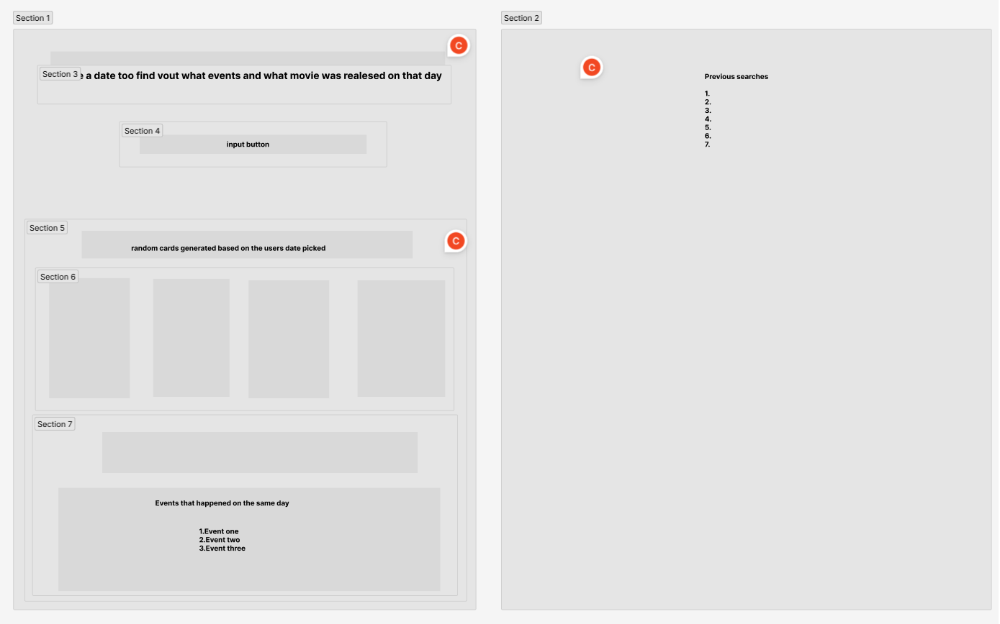



# On that day

User story:

* As a user when I select a specific day from the calendar I want to have displayed on the screen what movie was released on that day , also another three notable events that happened on the same day

## Technologies
* We used Bootstrap so that our application will be responsive on different devices
* Flexbox
* We used two server API's :
    - [Movie database](https://api.themoviedb.org)
    - [Notable events](https://api.wikimedia.org)

    ## Wireframe 

    

    ## Acknowledgements

    * [Bootstrap 4.0](https://getbootstrap.com/docs/4.0/getting-started/introduction/)
    * [W3 Schools](https://www.w3schools.com/)
    * [Movie database](https://api.themoviedb.org)
    * [Notable events](https://api.wikimedia.org)
    
    ## Mentions
    * Dane Edwards our instructor gave us some tips , and guidance with our project.

    ## Collaborators
    * [Chidi Nwanneka](https://github.com/cnwanneka)
    * [Barry Moore](https://github.com/barrymoore1990)
    * [Cristian Mitu](https://github.com/cristianmitu)

